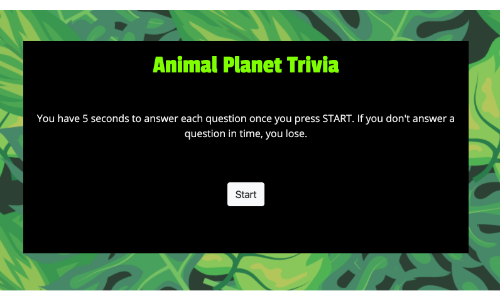

# TriviaGame
An iteractive game for web browswers. A Trivia game using JavaScript for the logic and jQuery to manipulate HTML.

### How to Play
Click start to begin. Questions are individually timed (5 sec per question). Answer all questions corectly to win.  If you do answer a question in time, game ends and your score is revealed. If you answer all questions, game is over and your score is revealed.

## Built With
* [Bootstrap](https://getbootstrap.com/) - responsive framework for web
* [Google Fonts](https://fonts.google.com/) - open source typography catalog
* Javascript
* JQuery

## Versioning & Author
This is the only version and is maintained by me, [sabomade](https://github.com/sabomade).

## Acknowledgements
Built & completed as part of the UCB Coding Bootcamp, Homework 5: Javascript 2 (timers & review)

